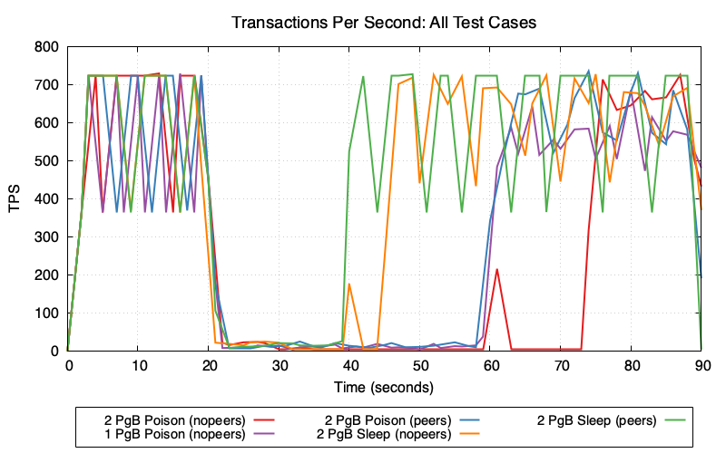
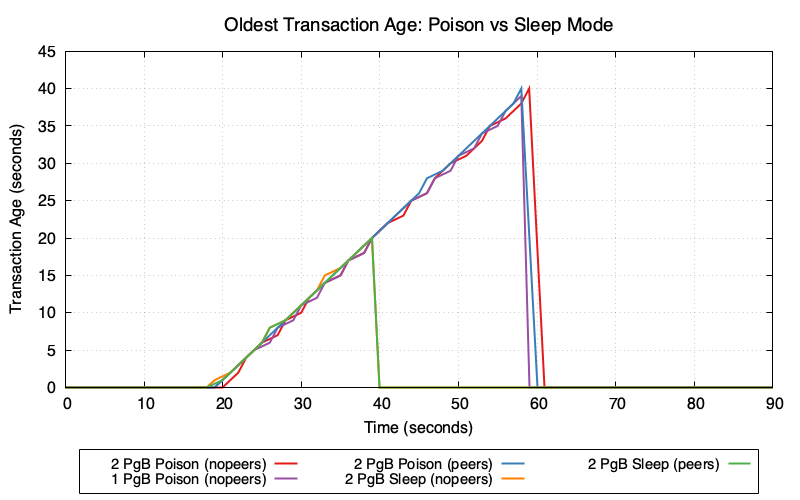
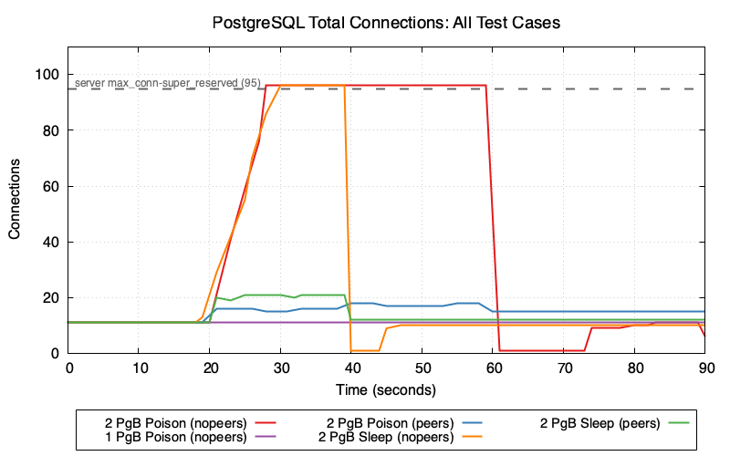
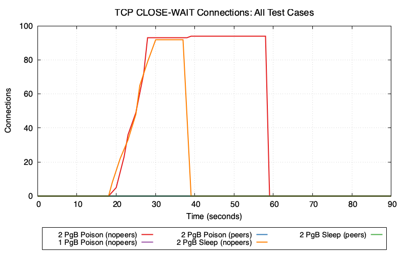
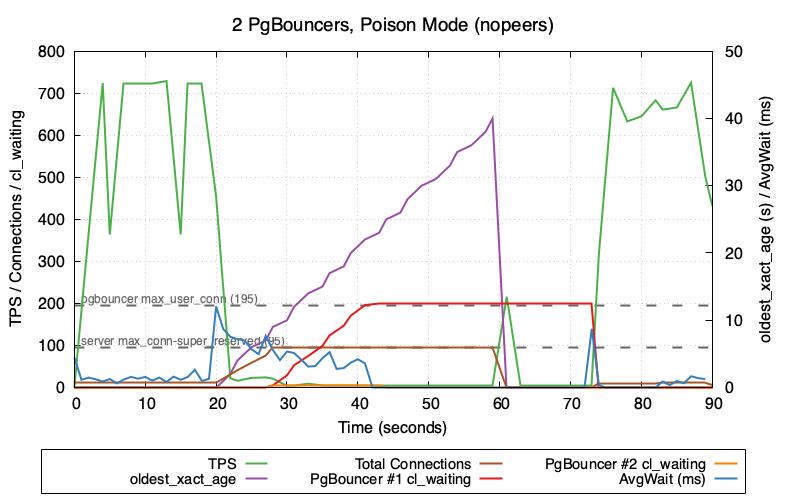
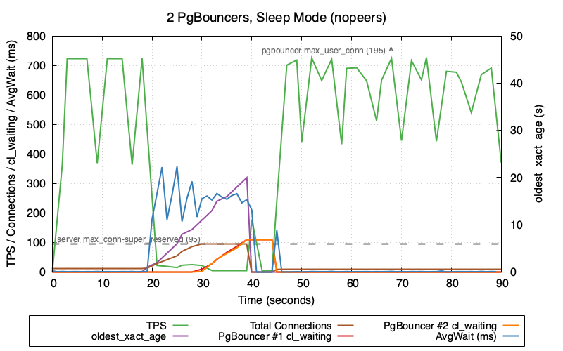

# How Blocking-Lock Brownouts Escalate from Row-Level to Complete System Outages

This test suite demonstrates a failure mode when **application bugs which poison connection pools** collide with **PgBouncers that are missing peer config and positioned behind a load balancer**. PgBouncer's peering feature (added with v1.19 in 2023) should be configured if multiple PgBouncers are being used with a load balancer - this feature prevents the escalation demonstrated here.

The failures described here are based on real-world experiences. While uncommon, this failure mode has been seen multiple times in the field.

Along the way, we discover unexpected behaviors (bugs?) in Go's `database/sql` (or `sqlx`) connection pooler with the `pgx` client and in Postgres itself.

**Sample output:** https://github.com/ardentperf/pg-idle-test/actions/workflows/test.yml

## The Problem in Brief

Go's `database/sql` allows connection pools to become poisoned by returning connections with open transactions for re-use. Transactions opened with `db.BeginTx()` will be cleaned up, but - for example - `conn.ExecContext(..., "BEGIN")` will not be cleaned up. [PR #2481](https://github.com/jackc/pgx/pull/2481) proposes some cleanup logic in pgx for `database/sql` connection pools (not yet merged); I tested the PR with this test suite. The PR relies on the `TxStatus` indicator in the `ReadyForStatus` message which Postgres sends back to the client as part of its network protocol.

A poisoned connection pool can cause an application brownout since other sessions updating the same row wait indefinitely for the blocking transaction to commit or rollback its own update. On a high-activity or critical table, this can quickly lead to significant pile-ups of connections waiting to update the same locked row. With Go this means context deadline timeouts and retries and connection thrashing by all of the threads and processes that are trying to update the row. Backoff logic is often lacking in these code paths. When there is a currently running SQL (hung - waiting for a lock), `pgx` first tries to send a cancel request and then will proceed to a hard socket close.
 
 If PgBouncer's peering feature is not enabled, then cancel requests load-balanced across multiple PgBouncers will fail because the cancel key only exists on the PgBouncer that created the original connection. The peering feature solves the cancel routing problem by allowing PgBouncers to forward cancel requests to the correct peer that holds the cancel key. This feature should be enabled - the test suite demonstrates what happens when it is not.

Postgres immediately cleans up connections when it receives a cancel request. However, Postgres does not clean up connections when their TCP sockets are hard closed, if the connection is waiting for a lock. As a result, Postgres connection usage climbs while PgBouncer continually opens new connections that block on the same row. The app's poisoned connection pool quickly leads to complete connection exhaustion in the Postgres server.

Existing connections will continue to work, as long as they don't try to update the row which is locked. But the row-level brownout now becomes a database-level brownout - or perhaps a complete system outage (once the Go `database/sql` connection pool is exhausted) - because postgres rejects all new connection attempts from the application.

**Result**: Failed cancels → client closes socket → backends keep running → CLOSE_WAIT accumulates → Postgres hits `max_connections` → system outage

## Table of Contents

- [Architecture](#architecture)
- [The Test Scenarios](#the-test-scenarios)
- [Test Results](#test-results)
- [Understanding the Layers Leading to the System Outage](#understanding-the-layers-leading-to-the-system-outage)
- [Unique Problems](#unique-problems)
- [Detection and Prevention](#detection-and-prevention)
- [Running the Tests](#running-the-tests)
- [Related Research](#related-research)


---

## Architecture

```
┌─────────────────────────────────────────────────────────────────────┐
│  Go Application (database/sql + pgx)                                │
│  ┌───────────────────────────────────────────────────────────────┐  │
│  │  database/sql Connection Pool                                 │  │
│  │  MaxOpenConns=10, MaxIdleConns=10                             │  │
│  │  ┌─────┐ ┌─────┐ ┌─────┐ ┌─────┐ ┌─────┐ ... ┌─────┐          │  │
│  │  │conn1│ │conn2│ │conn3│ │conn4│ │conn5│     │connN│          │  │
│  │  └──┬──┘ └──┬──┘ └──┬──┘ └──┬──┘ └──┬──┘     └──┬──┘          │  │
│  └─────┼───────┼───────┼───────┼───────┼───────────┼─────────────┘  │
│        └───────┴───────┴───────┴───────┴───────────┘                │
└─────────────────────────────────────────────────────────────────────┘
                                │
                                ▼
                    ┌───────────────────────┐
                    │  HAProxy (TCP mode)   │
                    │  Round-robin LB       │
                    └───────────┬───────────┘
                                │
                 ┌──────────────┴──────────────┐
                 ▼                             ▼
        ┌─────────────────┐           ┌─────────────────┐
        │  PgBouncer #1   │           │  PgBouncer #2   │
        │  Transaction    │           │  Transaction    │
        │  Pooling        │           │  Pooling        │
        │                 │           │                 │
        │ Cancel Key: A   │           │ Cancel Key: B   │
        └────────┬────────┘           └────────┬────────┘
                 │                             │
                 └──────────────┬──────────────┘
                                ▼
                    ┌───────────────────────┐
                    │  Postgres             │
                    │  max_connections=100  │
                    │  superuser_reserved=5 │
                    └───────────────────────┘
```

The test uses Docker to create this infrastructure with configurable number of PgBouncer instances.

---

## The Test Scenarios

`test_poisoned_connpool_exhaustion.sh` accepts three parameters: `<num_pgbouncers> <poison|sleep> <peers|nopeers>`

In this test suite:
1. The failure is injected 20 seconds after the test starts.
2. Idle connections are aborted and rolled back after 20 seconds. 
3. Postgres is configured to abort and rollback **any and all** transactions if they are not completed within 40 seconds. Note that the `transaction_timeout` setting (for total transaction time) should be used cautiously, and is available in Postgres v17 and newer.

### PgBouncer Count: 1 vs 2 (nopeers mode)

| Config | Cancel Behavior | Outcome |
|--------|-----------------|---------|
| **1 PgBouncer** | All cancels route to same instance | Cancels succeed, no connection exhaustion |
| **2 PgBouncers** | ~50% cancels route to wrong instance | Cancels fail, connection exhaustion |

### Failure Mode: Sleep vs Poison

| Mode | What Happens | Outcome | Timeout |
|------|--------------|-----------|---------------------------------------|
| **sleep** | Transaction with row lock is held for 40 seconds *without returning to pool* | Normal blocking scenario where lock holder is idle (not sending queries) | Idle timeout fires after 20s, terminates session & releases locks |
| **poison** | Transaction with row lock is returned to pool *while still open* | Bug where connections with open transactions are reused | Idle timeout never fires (connection is actively used). Transaction timeout fires after 40s, terminates session and releases locks |

### Pool Mode: nopeers vs peers (2 PgBouncers)

| Mode | PgBouncer Config | Cancel Behavior |
|------|------------------|-----------------|
| **nopeers** | Independent PgBouncers (no peer awareness) | Cancel requests may route to wrong PgBouncer via load balancer |
| **peers** | PgBouncer peers enabled (cancel key sharing) | Cancel requests are forwarded to correct peer |

### Summary

| PgBouncers | Failure Mode | Pool Mode | Expected Outcome |
|------------|------|------|------------------|
| 2 | poison | nopeers | **Database-level Brownout or System Outage** - TPS crashes to ~4, server connections max out at 95, TCP sockets accumulate in CLOSE_WAIT state, cl_waiting spikes |
| 1 | poison | nopeers | **Row-level Brownout** - TPS drops with no recovery (~11), server connections stay healthy at ~11, no server connection exhaustion |
| 2 | poison | peers | **Row-level Brownout** - TPS drops with no recovery (~15), cl_waiting stays at 0, peers forward cancels correctly |
| 2 | sleep | nopeers | **Database-level Brownout or System Outage** - Server connection spike to 96, full recovery after lock released and some extra time, system outage vs brownout depends on how quickly the idle timeout releases lock |
| 2 | sleep | peers | **Row-level Brownout** - No connection spike, full recovery after lock released, no risk of system outage |


### Test Output

The test outputs two types of metrics: infrastructure metrics (from the test harness) and Go connection pool metrics (from the client application).

**Infrastructure metrics** (printed by the test script):

```
[27:26] pgb: cl_act=7:5 cl_wait=0:0 sv_act=6:4 | pg: tot=32 act=28 idl=4 wait=26 | tcp: est=15 cw=23 | xact=2s tps=178
```

| Metric | Meaning |
|--------|---------|
| `pgb: cl_act=7:5` | Client connections active on PgBouncer 1 / PgBouncer 2 |
| `pgb: cl_wait=0:0` | Clients waiting for a PgBouncer server connection |
| `pgb: sv_act=6:4` | Server connections active (to Postgres) on each PgBouncer |
| `pg: tot=32` | Total Postgres backend connections |
| `pg: act=28` | Active (not idle) backends |
| `pg: idl=4` | Idle backends |
| `pg: wait=26` | Backends waiting on a lock |
| `tcp: est=15` | ESTABLISHED TCP connections (on Postgres container) |
| `tcp: cw=23` | **CLOSE_WAIT** TCP connections (problem indicator!) |
| `xact=2s` | Oldest transaction age |
| `tps=178` | Transactions per second |

**Go connection pool metrics** (printed by the client via `database/sql` stats):

```
[27:26] POOL_STATS: Open=10 InUse=8 Idle=2 Waits/s=15 AvgWait=42.50ms MaxIdleClosed/s=0 MaxLifetimeClosed/s=0 MaxIdleTimeClosed/s=0
```

| Metric | Meaning |
|--------|---------|
| `Open` | Total open connections in the Go pool |
| `InUse` | Connections currently in use by queries |
| `Idle` | Connections idle in the pool |
| `Waits/s` | Number of times a goroutine had to wait for a connection (per second) |
| `AvgWait` | Average wait time per wait (in milliseconds) |
| `MaxIdleClosed/s` | Connections closed due to exceeding `SetMaxIdleConns` (per second) |
| `MaxLifetimeClosed/s` | Connections closed due to `SetConnMaxLifetime` (per second) |
| `MaxIdleTimeClosed/s` | Connections closed due to `SetConnMaxIdleTime` (per second) |

The `AvgWait` metric is particularly useful for understanding client-side contention. In poison mode, `AvgWait` stays near zero because the poisoned connection is constantly being returned to the pool (despite being unusable). In sleep mode, `AvgWait` increases because workers must wait for the limited healthy connections.

---

## Test Results

### Transactions Per Second

TPS is the best indicator of actual application impact. It's important to notice that PgBouncer peering does not prevent application impact from either poisoned connection pools or sleeping sessions. The section below titled "Detection and Prevention" has ideas which address the actual root cause and truly prevent application impact.



After the lock is acquired at t=20, TPS drops from ~700 to near zero in all cases as workers block on the locked row held by the open transaction.

**Sleep mode** (orange/green lines): Around t=40, Postgres's `idle_in_transaction_session_timeout` (20s) fires and kills the blocking session. TPS recovers to ~600-700.

**Poison mode** (red/purple/blue lines): The lock-holding connection is never idle—it's constantly being picked up by workers attempting queries—so the idle timeout never fires. TPS remains near zero until Postgres's `transaction_timeout` (40s) fires at t=60, finally terminating the long-running transaction and releasing the lock.

### Oldest Transaction Age



This metric shows the age of the oldest open transaction in Postgres—a key indicator of stuck or long-running transactions.

**Poison mode** (red/purple/blue lines): The transaction age climbs from 0 to 40 seconds because the poisoned connection holds a transaction open. Workers keep picking it up from the pool, so it's never idle long enough for `idle_in_transaction_session_timeout` to fire. The transaction is finally terminated by `transaction_timeout` (40s) at t=60.

**Sleep mode** (orange/green lines): The transaction age climbs to ~20 seconds until `idle_in_transaction_session_timeout` (20s) fires and terminates the blocking session at t=40, resetting the metric to zero.

This is collected as `cnpg_backends_max_tx_duration_seconds` from CloudNativePG and is displayed on the CNPG provided Grafana dashboard. See [CNPG default monitoring queries](https://github.com/cloudnative-pg/cloudnative-pg/blob/main/config/manager/default-monitoring.yaml).

### Postgres Connection Count: All Test Cases



**2 PgBouncers (nopeers)** (red/orange lines): Postgres connections spike to `max_connections - superuser_reserved_connections` (95 out of 100) and stay there until the blocking transaction is terminated. In poison mode (red), connections remain maxed until `transaction_timeout` fires at t=60. In sleep mode (orange), connections recover around t=40 when `idle_in_transaction_session_timeout` fires.

**1 PgBouncer** (purple line): Connections stay at ~10-15 because cancel requests succeed—all cancels route to the same PgBouncer instance that holds the cancel key.

**2 PgBouncers (peers)** (blue/green lines): Connections stay low (~15-20) because PgBouncer's peer feature correctly forwards cancel requests to the PgBouncer that holds the cancel key.

Connection counts are collected as `cnpg_backends_total` from CloudNativePG (per database and per user) and displayed on the CNPG provided Grafana dashboard. See [CNPG default monitoring queries](https://github.com/cloudnative-pg/cloudnative-pg/blob/main/config/manager/default-monitoring.yaml).

### TCP CLOSE-WAIT Accumulation



**2 PgBouncers (nopeers)** (red/orange lines): CLOSE_WAIT connections accumulate rapidly because:
1. Cancel request goes to wrong PgBouncer → fails
2. Client gives up and closes socket
3. Server backend is still blocked on lock, hasn't read the TCP close
4. Connection enters CLOSE_WAIT state on Postgres

In poison mode (red), CLOSE_WAIT remains at ~95 until `transaction_timeout` fires at t=60. In sleep mode (orange), CLOSE_WAIT clears around t=40 when `idle_in_transaction_session_timeout` fires.

**1 PgBouncer and peers modes** (purple/blue/green lines): Minimal or zero CLOSE_WAIT because cancel requests succeed—either routing to the single PgBouncer or being forwarded to the correct peer.

### Connection Pool Wait Time vs PgBouncer Client Wait

Go's `database/sql` pool tracks how long goroutines wait to acquire a connection (`db.Stats().WaitDuration`). PgBouncer tracks `cl_waiting`—clients waiting for a server connection. These metrics measure wait time at different layers of the stack.

#### Poison Mode



This graph shows 2 PgBouncers in poison mode (nopeers)—the worst-case scenario:

- **Total Connections** (brown) climb rapidly after poison injection at t=20 as failed cancels leave backends in CLOSE_WAIT
- **TPS** (green) crashes to near zero and stays there until `transaction_timeout` fires at t=60
- **oldest_xact_age** (purple) climbs steadily from 0 to 40 seconds
- Once Postgres hits `max_connections - superuser_reserved_connections` (95), new connections are refused
- **PgBouncer #1 cl_waiting** (red) then spikes as clients queue up waiting for available connections
- **AvgWait** (blue) increases as workers wait for the non-blocked connections to become available

Note the gap between when `transaction_timeout` fires (t=60, visible as oldest_xact_age dropping to 0) and when TPS fully recovers. TPS recovery correlates with `cl_waiting` dropping back to zero—PgBouncer needs time to clear the queue of waiting clients and re-establish healthy connection flow. This recovery gap only occurs in nopeers mode; the TPS comparison graph shows that peers mode recovers immediately when the lock is released because connections never exhaust and `cl_waiting` stays at zero.

Why is **AvgWait** (blue) so low despite the system being in distress? The poisoned connection (holding the lock) continues executing transactions without blocking—it already holds the lock, so its queries succeed immediately. This one connection cycling rapidly through the pool with sub-millisecond wait times heavily skews the average lower, masking the fact that other connections are blocked.

The `cl_waiting` metric is collected as `cnpg_pgbouncer_pools_cl_waiting` from CloudNativePG. See [CNPG PgBouncer metrics](https://github.com/cloudnative-pg/cloudnative-pg/blob/main/pkg/management/pgbouncer/metricsserver/pools.go).

#### Sleep Mode



This graph shows 2 PgBouncers in sleep mode (nopeers):

- **Total Connections** (brown) spike to 95 as failed cancels accumulate backends in CLOSE_WAIT
- **TPS** (green) crashes after t=20 but recovers after `idle_in_transaction_session_timeout` fires at t=40
- **oldest_xact_age** (purple) climbs to ~20 seconds before the idle timeout terminates the session
- Once Postgres hits `max_connections - superuser_reserved_connections` (95), new connections are refused
- **cl_waiting** (red/orange) briefly spikes as Postgres connections max out, then recovers
- **AvgWait** (blue) spikes to 200-300ms as workers wait for the 9 non-blocked connections to become available

As with poison mode, there's a visible gap between when the lock is released and when TPS fully recovers—TPS recovery correlates with `cl_waiting` returning to zero. This gap is specific to nopeers mode; the TPS comparison graph shows peers mode recovers immediately.

Unlike poison mode, the connection holding the lock is not returned to the pool, so the Go-level `AvgWait` accurately reflects the contention. The remaining 9 connections in the `database/sql` pool serve all workers. Since each query has a 500ms timeout, connections cycle back to the pool after timeout, creating measurable wait time at the Go level.

### Results Summary

| Metric | 1 PgB Poison | 2 PgB Poison (nopeers) | 2 PgB Poison (peers) | 2 PgB Sleep (nopeers) | 2 PgB Sleep (peers) |
|--------|--------------|------------------------|----------------------|-----------------------|---------------------|
| Postgres canceling statement | 695 | 60 | 695 | 99 | 149 |
| Postgres idle-in-transaction timeout | 0 | 0 | 0 | 1 | 1 |
| Postgres transaction timeout | 1 | 1 | 1 | 0 | 0 |
| PgBouncer failed cancel requests | 0 | 188 | 0 | 202 | 0 |
| Client superuser reserved errors | 0 | 4324 | 0 | 832 | 0 |
| Client max_client_conn errors | 0 | 1011 | 0 | 0 | 0 |
| Client context deadline exceeded | 695 | 335 | 697 | 642 | 627 |
| Connection returned with open txn | 31 | 16 | 36 | 0 | 0 |

Key observations:
- **Failed cancels only occur with 2 PgBouncers in nopeers mode** - the peers feature correctly forwards cancel requests
- **Poison mode shows connection leak** - open transactions returned to the Go pool, causing TxStatus warnings
- **Sleep mode recovers via idle timeout** - fires after 20s because the blocking connection is idle
- **Poison mode recovers via transaction timeout** - fires after 40s because the poisoned connection is never idle
- **nopeers mode exhausts Postgres connections** - both poison and sleep modes trigger superuser reserved errors when cancels fail
- **In all scenarios, TPS collapses and context-deadline-exceeded is high** - workers time out waiting for the blocked row lock

---

## Understanding the Layers Leading to the System Outage

### Part 1: The Poisoned Connection Pool

Go's `database/sql` (and `sqlx`, which wraps it) has a critical flaw when used with pgx's stdlib adapter: it does **not check transaction state** when returning connections to the pool.

From [`poison_connpool.go`](https://github.com/ardentperf/pg-idle-test/blob/main/conn_exhaustion/poison_connpool.go):

```go
// Poison the connection pool by starting a transaction and returning to pool
conn, _ := db.Conn(context.Background())
conn.ExecContext(context.Background(), "BEGIN")
conn.ExecContext(context.Background(), "UPDATE test_row SET val = val + 1 WHERE id = 1 -- POISON")
conn.Close()  // Returns to pool WITH OPEN TRANSACTION
```

When another goroutine picks up this connection, it inherits the open transaction and the row lock. The `client.log` file will also shows warnings:

```
WARNING: Connection returned to pool with open transaction (TxStatus=T)
```

This creates two distinct behaviors:

**The poisoned connection** (holding the lock):
- Queries execute successfully and quickly inside subtransactions
- The lock is already held, so no blocking occurs
- This connection appears healthy and skews performance metrics

**Non-poisoned connections** (trying to acquire the lock):
1. Worker picks up a clean connection from the pool
2. Worker's UPDATE blocks waiting for the row lock held by the poisoned connection
3. Worker's context deadline (500ms) expires
4. pgx sends `CancelRequest` to Postgres
5. Cancel may fail (if 2 PgBouncers and request routes to wrong instance)
6. If cancel fails: connection remains blocked, enters CLOSE_WAIT when client closes socket
7. Postgres does not check socket status while waiting indefinitely for transaction lock
8. PgBouncer has closed its server connections so it opens new connections
9. Postgres connections exhaust, workers start queuing at PgBouncer (`cl_waiting` increases)

### Part 2: Cancel Request Routing with Load Balancers

Postgres's cancel protocol requires:
1. A **new TCP connection** to send the cancel
2. The **backend PID** and **secret key** from the original connection

When cancel requests are load-balanced to a different PgBouncer than the original connection, the cancel fails because that PgBouncer doesn't have the cancel key for that backend.

**With 1 PgBouncer** - all cancels succeed:
```
# pgbouncer_1.log shows 1,386 successful cancels, 0 failures
2026-01-18 09:16:21.300 UTC [1] LOG S-0xffff926c2b30: testdb/testuser@172.21.0.2:5432 closing because: successfully sent cancel request (age=0s)
2026-01-18 09:16:21.302 UTC [1] LOG S-0xffff926c16d8: testdb/testuser@172.21.0.2:5432 closing because: successfully sent cancel request (age=0s)
```

**With 2 PgBouncers** - many cancels fail:
```
# pgbouncer_1.log: 166 failed, 28 successful
# pgbouncer_2.log: 120 failed, 30 successful
# Total: 286 failed (83%), 58 successful (17%)

2026-01-18 09:16:21.294 UTC [1] LOG C-0xffff9271a828: (nodb)/(nouser)@172.21.0.5:55068 closing because: failed cancel request (age=0s)
2026-01-18 09:16:21.808 UTC [1] LOG C-0xffff9271a540: (nodb)/(nouser)@172.21.0.5:55202 closing because: failed cancel request (age=0s)
```

Note the `(nodb)/(nouser)` in failed cancel attempts - these are cancel-only connections that HAProxy routed to the wrong PgBouncer instance, which doesn't have the cancel key.

See [`pgbouncer-cancelation-behavior.md`](../research/pgbouncer-cancelation-behavior.md) for detailed analysis of PgBouncer's cancel handling.

### Part 3: CLOSE_WAIT Accumulation

When a cancel fails:
1. Client gives up waiting (context deadline)
2. Client closes its TCP socket
3. PgBouncer receives FIN, closes its connection to client
4. PgBouncer closes the backend server connection
5. Postgres backend is blocked on lock, hasn't read from socket
6. Backend connection enters **CLOSE_WAIT** state

The backend remains in CLOSE_WAIT indefinitely because:
- **Blocked backends don't check socket state** - they only discover the dead connection when they try to read/write
- The backend will only detect the closed socket after the lock is released and it tries to send query results

Meanwhile, this backend **still counts against `max_connections`**.

**TCP keepalive didn't work in my tests to clear CLOSE_WAIT connections.** See the [client kill test](../test_client_kill.sh) which specifically configures TCP keepalive with aggressive keepalive settings (idle=10s, interval=3s, count=3), but backends remained in CLOSE_WAIT for 60+ seconds until the lock is released.

### Part 4: The Cascade

With 2 PgBouncers in poison mode (nopeers), the graphs show a clear progression:

1. **Normal operation** (t=0-20): TPS steady at ~700, connections stable at ~10
2. **Poison injection** (t=20): Connection returned to pool with open transaction
3. **Rapid connection climb**: Postgres connections spike from ~10 to 95 within seconds as failed cancels leave backends in CLOSE_WAIT (visible in both the connections and CLOSE_WAIT graphs)
4. **System outage**: Once Postgres hits `max_connections - superuser_reserved_connections` (95), TPS crashes to near zero and clients see errors: "remaining connection slots are reserved for roles with the SUPERUSER attribute" and "no more connections allowed (max_client_conn)"
5. **Recovery** (t=60): `transaction_timeout` fires, lock released, connections and TPS recover

---

## Unique Problems

### Why `idle_in_transaction_session_timeout` Doesn't Help a Poisoned Connection Pool

Postgres's `idle_in_transaction_session_timeout` terminates backends that are **idle** within a transaction block. But in poison mode, the poisoned connection is constantly being picked up by workers and running queries.

The workers don't know they are actually running in subtransactions instead of top-level transactions. From Postgres's perspective, the backend holding the lock is not idle, but is **active** and running a normal long transaction with many subtransactions.


### Tradeoffs of `transaction_timeout`

`transaction_timeout` (added in Postgres 17) provides a safety net for poison mode scenarios, but it comes with tradeoffs:

- **Blunt instrument**: It terminates *any* transaction exceeding the limit, including legitimate long-running operations like batch imports, migrations, or analytical queries
- **Requires Postgres 17+**: Not available in earlier versions
- **Limits duration, doesn't prevent**: The system still experiences an outage—`transaction_timeout` just caps how long it lasts
- **Tuning challenges**: Set too low and you break legitimate workloads; set too high and the outage window remains unacceptably long

For these reasons, `transaction_timeout` is best viewed as a last-resort safety net rather than a primary defense.

Enabling PgBouncer peers prevents the *escalation* to connection exhaustion and system outage, but the row-level brownout (TPS drop) still occurs until the lock is released. Fixing connection pool leaks addresses the root cause.

### Why pgx's Cancel Logic Works with DNS Round-Robin But Fails with HAProxy/Load Balancer

pgx is smart about cancellation - it uses `conn.RemoteAddr()` to send the cancel request to the **exact IP address** of the original connection, not re-resolving DNS. See [`dns-round-robin-cancellation.md`](../research/dns-round-robin-cancellation.md).

From [pgx's `CancelRequest()`](https://github.com/jackc/pgx/blob/v5.8.0/pgconn/pgconn.go#L1005-L1019):
```go
// Open a cancellation request to the same server. The address is taken from 
// the net.Conn directly instead of reusing the connection config. This is 
// important in high availability configurations where fallback connections 
// may be specified or DNS may be used to load balance.
serverAddr := pgConn.conn.RemoteAddr()
```

But with HAProxy in front of PgBouncer:
- `conn.RemoteAddr()` returns **HAProxy's address**, not PgBouncer's
- The cancel request goes to HAProxy
- HAProxy round-robins it to a random PgBouncer
- **50% chance** it goes to the wrong PgBouncer → cancel fails

This is why the problem **only manifests with 2+ PgBouncer instances**.

---

## Detection and Prevention

**Monitoring and Alerting:**

Alert on:
- **Most Important:** `cnpg_backends_max_tx_duration_seconds` showing transactions open for longer than some threshold
- `cnpg_backends_total` showing established connections at a high percentage of `max_connections`
- Number of backends waiting on locks over some threshold

```sql
-- Count backends waiting on locks
SELECT count(*) FROM pg_stat_activity WHERE wait_event_type = 'Lock';
```

**Prevention Options:**

Options to prevent the root cause (connection pool poisoning):

1. **Find and fix connection leaks in the application** - ensure all transactions are properly committed or rolled back
2. **Use `OptionResetSession` callback** - automatically discard leaked connections (see below)
3. **Fix at the driver level** - [PR #2481](https://github.com/jackc/pgx/pull/2481) proposes automatic detection in pgx (not yet merged)

Options to prevent the *escalation* from row-level brownout to system outage:

1. **Enable PgBouncer peering** - if using multiple PgBouncers behind a load balancer, configure the `peer_id` and `[peers]` section so cancel requests are forwarded to the correct instance (see [PgBouncer documentation](https://www.pgbouncer.org/config.html#section-peers)). This prevents connection exhaustion but does not prevent the TPS drop from lock contention.
2. **Use session affinity (sticky sessions)** in the load balancer based on client IP - ensures cancel requests route to the same PgBouncer as the original connection (see [HAProxy Session Affinity example](#haproxy-session-affinity-source-ip) below)

Options to limit the duration/impact:

1. **Set appropriate timeout defaults** - configure system-wide timeouts to automatically terminate problematic sessions:
   - `idle_in_transaction_session_timeout` - terminates sessions idle in a transaction (e.g., `5min`)
   - `transaction_timeout` (Postgres 17+) - use caution; limits total transaction duration regardless of activity (e.g., `30min`)

**Potential Postgres Enhancement:**

This would not address the root cause, but Postgres could better handle CLOSE_WAIT accumulation by checking socket status while waiting for locks. Since Postgres already checks for interrupts periodically (which is why cancels work), it's possible that similar logic could detect forcibly closed sockets and clean up blocked backends sooner.

### Application Fix: OptionResetSession Callback

Use the `OptionResetSession` callback to check transaction state before reusing connections:

```go
config, _ := pgx.ParseConfig(connectionString)
db := stdlib.OpenDB(*config, stdlib.OptionResetSession(func(ctx context.Context, conn *pgx.Conn) error {
    if txStatus := conn.PgConn().TxStatus(); txStatus != 'I' {
        return driver.ErrBadConn  // Discard connection, don't reuse
    }
    return nil
}))
```

See [`stdlib-transaction-leak.md`](../research/stdlib-transaction-leak.md) for the full analysis.

### HAProxy Session Affinity (Source IP)

Change `balance roundrobin` to `balance source` so cancel requests (which come from the same client IP) route to the same PgBouncer:

```haproxy
backend pgbouncer_backend
    balance source
    hash-type consistent
    server-template pgb 10 pgbouncer:5432 resolvers docker
```

The `hash-type consistent` ensures minimal disruption when backends are added/removed.


---

## Running the Tests

**Sample output:** https://github.com/ardentperf/pg-idle-test/actions/workflows/test.yml

**Prerequisites:**
- Docker installed and available
- Go toolchain
- gnuplot (for generating graphs)

**Run experiments as desired:**

```bash
cd conn_exhaustion

# 2 PgBouncers + poison + nopeers (worst case: system outage until transaction_timeout)
./test_poisoned_connpool_exhaustion.sh 2 poison nopeers

# 2 PgBouncers + sleep + peers (best case: recovery via idle_in_transaction_session_timeout and correct pgbouncer peering)
./test_poisoned_connpool_exhaustion.sh 2 sleep peers
```

**Generate all data and graphs used in this article:**

```bash
cd conn_exhaustion

./generate_data.sh     # Runs all 5 test scenarios
./extract_data.sh      # Extracts metrics from logs
gnuplot generate_graphs.gp  # Generates PNG graphs
```

---

## Related Research

| Document | Description |
|----------|-------------|
| [`stdlib-transaction-leak.md`](../research/stdlib-transaction-leak.md) | How connections with open transactions leak in `database/sql` |
| [`pgbouncer-cancelation-behavior.md`](../research/pgbouncer-cancelation-behavior.md) | Deep dive into PgBouncer's cancel request handling |
| [`dns-round-robin-cancellation.md`](../research/dns-round-robin-cancellation.md) | How pgx ensures cancels go to the right server |
| [`readyforquery_txstatus.md`](../research/readyforquery_txstatus.md) | Postgres's transaction status protocol |
